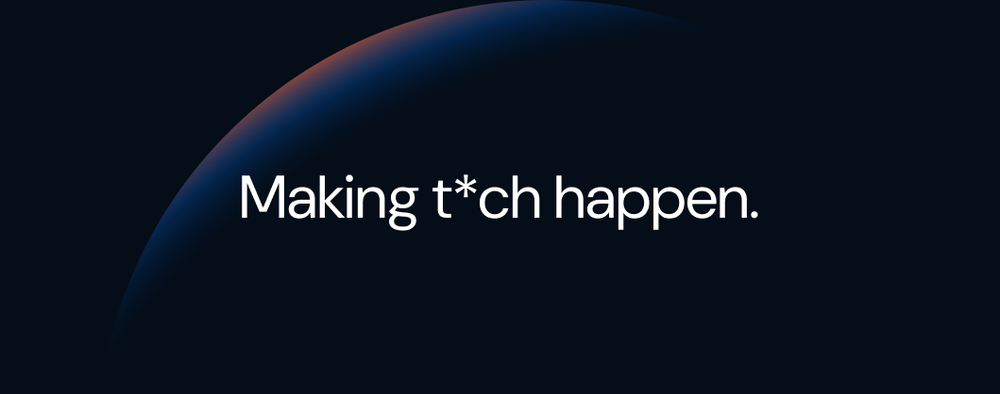
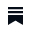
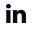
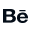

### We build the future, one commit at a time.

We are a digital product studio that solves complex challenges by developing websites, apps and stores that ensure your business stays relevant in today’s digital world. Everything we do is meaningful, memorable, and measurable. People-centric. Always.

---

#### Where to Find Us

    <a href="https://www.miew.pt">
        
        
        
    </a>
  <a href="https://www.linkedin.com/company/miew/">
    
      
    
  </a>
  <a href="https://www.instagram.com/wearemiew/">
    
      
    
  </a>
  <a href="https://dribbble.com/miew">
    
      
    
  </a>
  <a href="https://www.behance.net/miew">
    
      
    
  </a>

---
#### Technologies We Love

    
    
    
    
    
    
    
    
    

